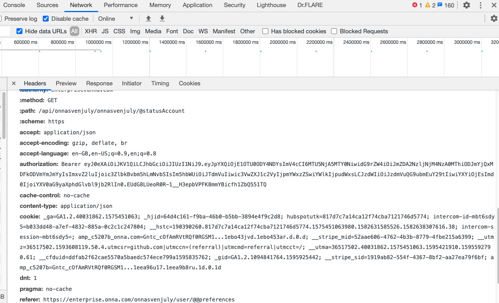
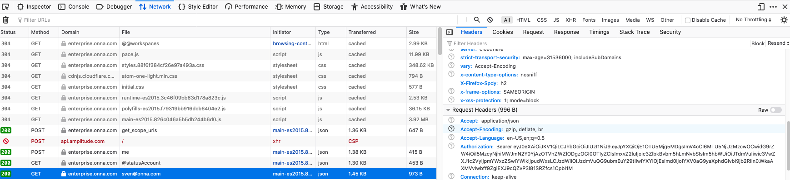
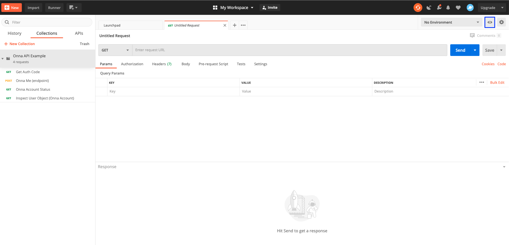
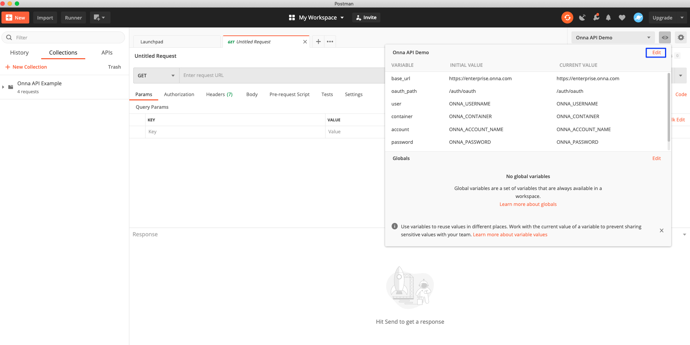
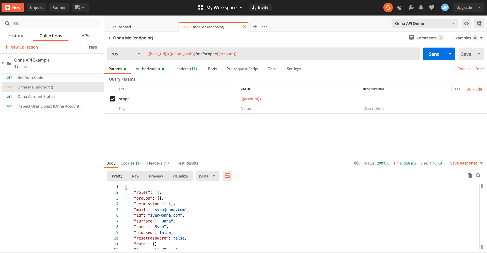
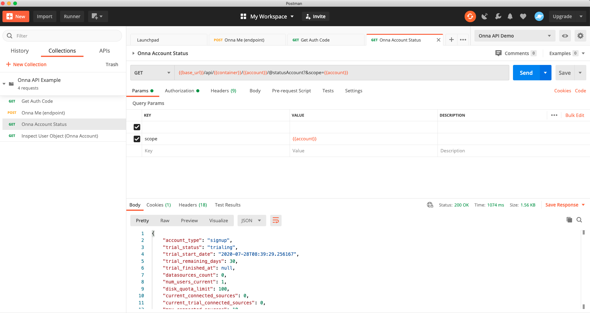

<!-- Here build and CI badges -->

<!-- vale off -->

---

<!-- PROJECT LOGO -->

<h1 align="center">
   
  </a>
</h1>

<h2 align="center">Onna Postman Collections</h2>

## About

These are Postman collections for showcasing Onna.

The `environment.json` files provided contain a list of variables used by the API collection.

Refer to our [documentation](https://developers.onna.com "Link to Onna developer docs") for usage, and to register a Developer account with us.

## Requirements

- [Postman](https://www.getpostman.com/), which is available for free.
- [Onna account](https://register.onna.com/signup?trial=true "Link to trail sign up")

## Installing (Via Github Download)

TODO: Add screens and rewrite below, because we may have more collections in the future!

1. Download and install [Postman](https://www.postman.com/ "Link to Postman").
2. Sign up for an [Onna account](https://register.onna.com/signup?trial=true "Link to trail sign up") and follow the instructions.
3. Download the `onna-api-example.json` and `environment.json` files from the [GitHub repo](https://github.com/onna/postman-demo "Link to Onna Demo Repo on GitHub").

<!-- vale on -->

## Configuration

### Token

#### Chrome

1. Launch Chrome’s built-in developer tools using `[F12]`.
2. Open the Network tab.
3. Hit `[F5]` or browse to something within the current tab.
4. Once you have some output select the name of any object to view the HTTP headers.
5. Scroll to the **authorization Bearer** header and copy the token

### Firefox

1. Launch Firefox’s built-in developer tools using `[F12]`.
2. Select the **Network** tab in the developer tools navigation bar.
3. Hit  [F5] or browse to something within that tab.
4. Once you have some output select the name of any object with a `200` status to view the HTTP headers.

### Values

Postman allows to use a configurable environment using a set of key-value pairs.
Creating commonly used variables that can be referenced by multiple requests in a collection.

More documentation on the Postman environment can be found in the [Postman docs](https://www.getpostman.com/docs/v6/postman/environments_and_globals/manage_environments "Link to Postman docs about environments").

It is important that you edit and replace some of these variables with your own values.

Access the edit dialog by clicking the gray eye button next to the environment dropdown (highlighted in blue below):

Select *Edit* (highlighted in blue below):

Replace the following values with your own initial one:

- `user`: Username you provided during self-registration. For example `username@email.io`.
- `container`: The name of the database attached to your account. Onna naming convention is to use the account name you provided during the self-registration process.
- `account`: May be the same value as container.
- `password`: Password of your account.
- `token`: Your JWT token

`scope`, `container`, and `account` may be the same value.

You should have obtained these when creating your own [Onna account](https://register.onna.com/signup?trial=true "Onna account registration").

You can find more information in our [glossary](./glossary.md "Link to Onna glossary").

## Examples

### Retrieving Account Information

### Account Status Overview

